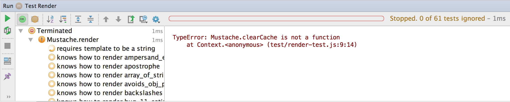
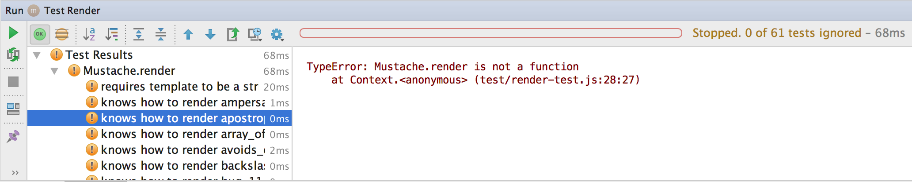
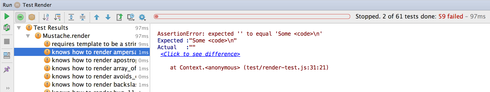
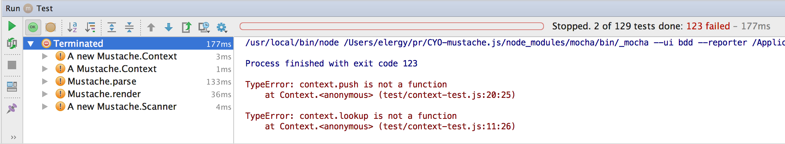

Пару слов о тестах. В проекте остались только два вида тестов: тесты функции Mustache.render и тесты отдельных компонентов библиотеки (в том числе и Mustache.render).
Чтобы их выполнить, запускаем команды:
`npm run test-render`

`npm run test` (или просто `npm test`)

Первая команда сразу говорит нам:
`TypeError: Mustache.clearCache is not a function`,
а сами тесты даже не стартуют.

Первый шаг к тому, чтобы получить работающие тесты - реализовать все функции, на отсутствие которых тесты ругаются. Начнем как раз с `Mustache.clearCache`:

```
var Mustache = {};

Mustache.clearCache = function() {};

module.exports = Mustache;
```

Теперь при выполнении `npm run test-render` мы получаем другую ошибку:
```TypeError: Mustache.render is not a function```

а значит, нужно реализовать и ее:
```
Mustache.render = function() { return ''; };
```
После чего все тесты запустятся, а два из них даже успешно пройдут


Теперь перейдем к тестам, которые тестируют модули по отдельности. Точно такие же проблемы ожидают нас и там:
1. `Context is not a function`
2. `Mustache.parse is not a function`
3. `Scanner is not a function`

Реализуем их:
```
Mustache.parse = function() {};
Mustache.Scanner = function() {};
Mustache.Context = function() {};
```
И посмотрим на результаты теста:


Здесь видно, что всего в библиотеке 129 тестов, два из которых завершились успешно, 123 с ошибкой, а оставшиеся по какой-то причине были прерваны. Также можно заметить, что все тесты подразделяются на 5 категорий:
1. Тесты функции Mustache.parse
2. Тесты функции Mustache.render
3. Тесты Mustache.Context
4. Тесты new Mustache.Context
5. Тесты new Mustache.Scanner

Осталось только понять, как должны работать функции `parse` и `render`, выяснить, чем отличаются `Context` и `new Context`, а также что такое `new Mustache.Scanner`. И, конечно же, все правильно реализовать :-)